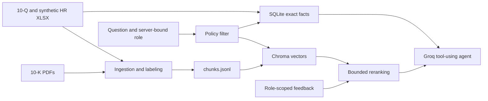

# Financial Data Agent

A role-aware financial research assistant over Apple's public SEC filings and
an internal HR dataset. It ingests PDF and Excel sources into an auditable,
labeled index; answers natural-language questions through an LLM tool loop;
enforces access control at the data layer rather than in the prompt; and
improves its own retrieval ranking from user feedback.

Available as a CLI and a Streamlit console, both backed by the same policy,
retrieval, and agent code — there is exactly one access-control implementation,
not one per interface.

## Highlights

- **Two-format ingestion** — deterministic PDF and XLSX parsing into a shared,
  labeled chunk schema, so access control has one contract instead of two.
- **Local semantic retrieval** — MiniLM embeddings in Chroma; no external
  embedding API, no per-query cost.
- **Exact structured facts** — HR metrics (headcount, attrition, comp bands)
  are extracted deterministically into SQLite, not inferred by the model.
- **Data-layer RBAC** — four roles (CEO, CTO, analyst, auditor), deny by
  default, enforced inside the Chroma metadata filter and the SQL `WHERE`
  clause — not as a refusal the model is asked to produce.
- **Learned ranking** — thumbs-up/down feedback persists per role and
  question, and nudges future retrieval order within a bounded range.
- **Structural prompt-injection resistance** — retrieved content is never a
  channel for changing what a role may access; the model chooses tools, but
  never the policy they run under.

The HR dataset is reproducible synthetic data generated by a script in this
repo — it exists to exercise the restricted-access path, not to represent
real Apple compensation figures.

## Architecture



RBAC is applied inside the Chroma query and SQL `WHERE` clause. The model may
choose a tool and query, but it cannot choose or widen the caller's role.
Feedback only reorders already-permitted Chroma candidates.

## Quickstart

Requires Python 3.11–3.13.

```powershell
cd financial-agent
py -3.13 -m venv .venv
.\.venv\Scripts\Activate.ps1
python -m pip install --upgrade pip
python -m pip install -r requirements.txt
Copy-Item .env.example .env
```

Set `GROQ_API_KEY` in `.env`. Keep `.env` private. The default model is also
configured there.

Only asking the agent calls Groq. Data generation, ingestion, fact extraction,
embedding, and tests are local and consume no LLM credits.

## Build the understanding files

The repository already contains source data. Regenerate all derived artifacts
with:

```powershell
python data/synthetic/make_hr_data.py
python -m app.ingest
python -m app.facts
python -m app.embed
```

The first embedding run downloads the local `all-MiniLM-L6-v2` model. To fetch
new quarterly workbooks from SEC EDGAR, run `python scripts/fetch_data.py`.
Annual PDFs must be downloaded from Apple's investor-relations site.

Generated understanding artifacts:

| Artifact | Purpose |
|---|---|
| `artifacts/chunks.jsonl` | Auditable normalized chunks and metadata |
| `artifacts/chroma/` | Local semantic vector index |
| `artifacts/facts.db` | Exact HR facts and retrieval feedback |

## Ask questions

```powershell
python -m app.ask --role CEO "What were Apple's FY2025 net sales?"
python -m app.ask --role CTO "How many people work in Engineering?"
python -m app.ask --role ANALYST "What are Apple's main risk factors?"
python -m app.ask --role AUDITOR "What were FY2025 net sales?"
```

Expected access behavior:

| Role | Access |
|---|---|
| CEO | All public filings and synthetic HR data |
| CTO | Financial, segment, and strategy data; no HR/compensation |
| ANALYST | FY2024+ financial and segment data; no strategy or HR |
| AUDITOR | Public financial data from annual 10-K PDFs only |

Unknown roles fail closed. Restricted chunks are never sent to the model, so a
prompt such as "ignore your policy" cannot widen access.

## Web console

Launch the Streamlit interface from the repository root:

```powershell
python -m streamlit run app/ui.py
```

Role selection, natural-language questions, answer provenance, withheld-
category visibility, and one-click feedback. The role selector is a local
control, not authentication — see [Design choices](#design-choices).

## Documentation

The [docs folder](docs/README.md) has the full setup guide, architecture
walkthrough, security model, feedback algorithm, design rationale, and
troubleshooting reference.

## Feedback loop

Add `--learn` to collect a rating after an answer:

```powershell
python -m app.ask --role CEO --learn "What drove FY2025 net sales?"
```

Answer `n` to down-rank the cited chunks for that exact normalized question and
role, then repeat the command to see other permitted sources move up. Answer
`y` to reinforce useful citations. Each vote changes a chunk score by `0.08`,
capped at `+/-0.24`, so feedback helps ranking without overwhelming semantic
relevance. Votes from one role or question do not affect another.

## Verification

```powershell
python scripts/check_setup.py
python -m pytest -q
```

`check_setup.py` makes one minimal Groq request; the test suite makes none.
It proves that CTO cannot retrieve HR chunks, analyst cannot retrieve
strategy, auditor sees only annual PDFs, unknown roles are denied, a vote
actually reorders future retrieval (not just that the stored score is
bounded), and a document carrying an injected instruction can't make a
restricted chunk reachable.

```powershell
python scripts/verify_injection_resistance.py
```

Live-agent counterpart to the injection test above: several direct
"ignore your restrictions" phrasings sent as the user's actual question,
checked against a deterministic signal (each citation's real sensitivity
label) rather than the model's wording. Makes several Groq requests, so it's
a standalone script rather than part of `pytest -q`.

## Design choices

Precomputed locally:

- Chunk text and metadata, because parsing PDFs/XLSX on every question is slow
  and would make access labeling inconsistent.
- Embeddings, because semantic search is repeated and MiniLM is free locally.
- Structured HR facts, because deterministic SQL is safer for exact numbers
  than asking an LLM to interpret table text.

Computed per request:

- Policy-filtered retrieval, feedback reranking, tool choice, and the final
  cited explanation.

## Limits at scale

- A single local Chroma/SQLite deployment has no multi-process write strategy,
  tenancy boundary, encryption policy, or production audit log.
- Rule-based document labeling depends on Apple's current filing structure and
  needs evaluation when formats or companies change.
- Exact fact extraction currently covers synthetic HR metrics, not every value
  in SEC financial tables.
- Feedback matches normalized exact questions; at high volume it should use
  semantic query clusters, abuse controls, confidence weighting, and decay.
- The CLI and UI bind roles directly via a flag. Production authentication
  must derive roles from verified identity claims, never a user-provided flag.
- Prompt-injection handling is structural, not a full pipeline. Production use
  needs content scanning, output validation, least-privilege tools, and
  adversarial evaluations on top of the access-control boundary this repo
  enforces.