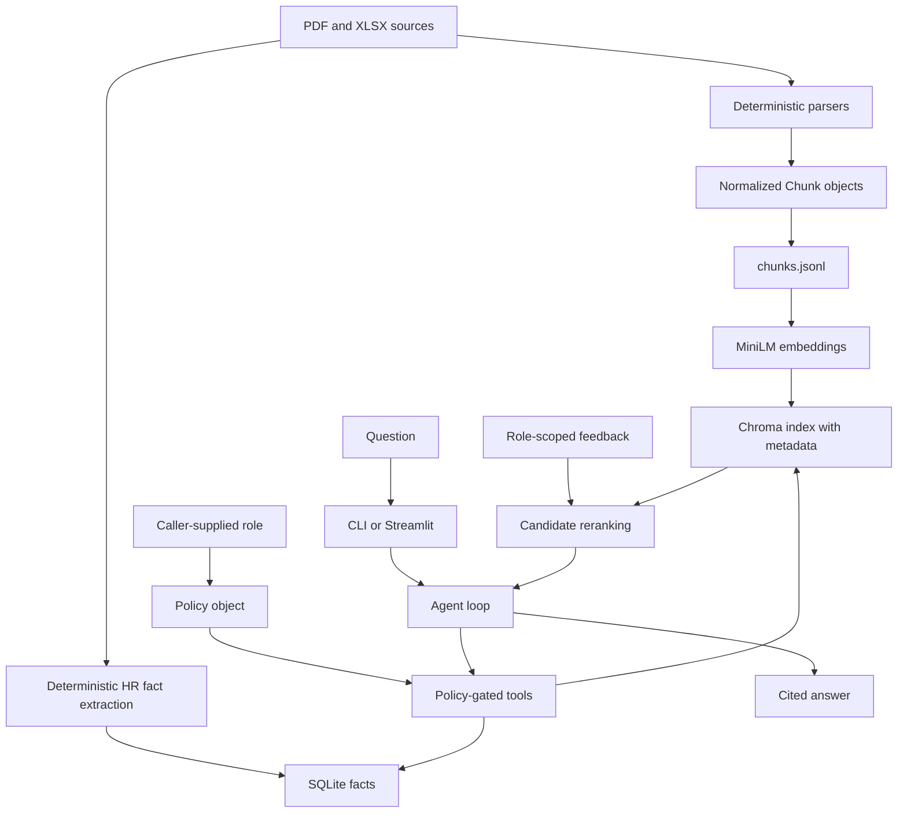

# Architecture

## System flow

## Module map

| Module | Owns | Important invariant |
|---|---|---|
| `app/config.py` | Paths and Groq settings | Paths are repository-relative |
| `app/schema.py` | `Chunk` contract and sensitivity labels | Unknown labels fail closed |
| `app/ingest_pdf.py` | PDF extraction, section labels, chunks | Section state moves forward only |
| `app/ingest_xlsx.py` | Workbook classification and table windows | Every chunk remains independently readable |
| `app/ingest.py` | Combined ingestion | Duplicate chunk IDs abort the build |
| `app/embed.py` | Local embeddings and Chroma build | Metadata travels with vectors |
| `app/facts.py` | Deterministic structured HR extraction | Numeric facts do not come from an LLM |
| `app/policy.py` | YAML roles and enforceable filters | Unknown role and label are denied |
| `app/retrieve.py` | Semantic search and feedback reranking | A `Policy` argument is mandatory |
| `app/tools.py` | Model-visible tools and execution | Role is bound by caller, not tool arguments |
| `app/agent.py` | Groq tool loop and answer assembly | Answer only from tool results |
| `app/feedback.py` | Persistent ratings and score boosts | Votes are scoped by role and question |
| `app/ask.py` | CLI | Thin adapter over shared backend |
| `app/ui.py` | Streamlit evaluation UI | Uses the same backend as CLI |

## Ingestion decisions

PDF pages are classified by the fixed 10-K Item sequence. The parser skips the
table of contents because it lists every section and would corrupt section
state. It creates overlapping windows of about 3,000 characters so a label and
nearby number are less likely to be separated.

XLSX sheets are classified as narrative notes or tables. Large tables become
row windows with repeated headers. Distinctive non-numeric terms are surfaced
in each window so sibling table embeddings differ meaningfully.

Both parsers emit the same `Chunk` shape. This matters because downstream RBAC
has one metadata contract rather than separate PDF and spreadsheet policies.

## Request branches

1. Narrative or public financial question: the model calls
   `search_documents`; Chroma searches only metadata permitted by the policy.
2. Exact HR number: the model calls `query_facts`; SQL filters sensitivity
   labels before selecting rows.
3. Access question: the model calls `list_my_access`; policy grants and denials
   are returned explicitly.
4. No useful evidence: the agent must report missing data rather than inventing
   a financial figure.

## Why two retrieval stores

| Store | Best at | Weakness handled by the other store |
|---|---|---|
| Chroma | Semantic narrative retrieval | Approximate retrieval is unsafe for exact totals |
| SQLite | Exact numeric filtering and aggregation | SQL cannot understand arbitrary narrative questions |

> Mental model: Chroma finds the right passage; SQLite supplies exact sensitive
> numbers; policy constrains both before the model receives anything.
